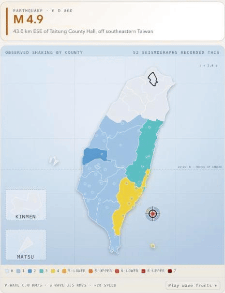
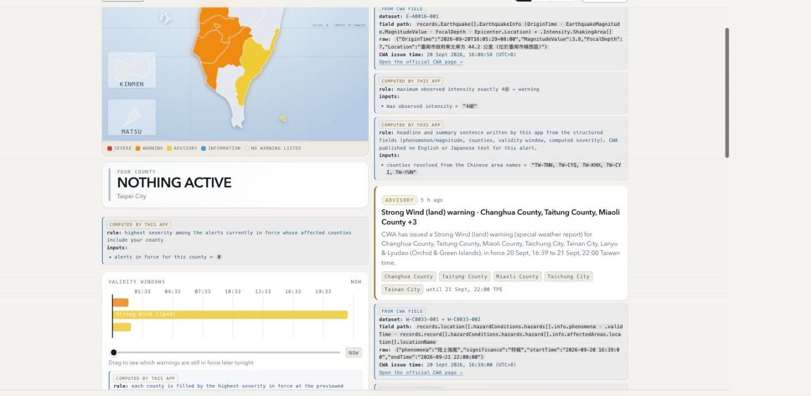
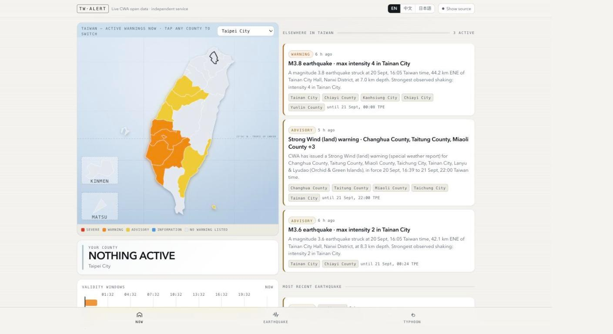
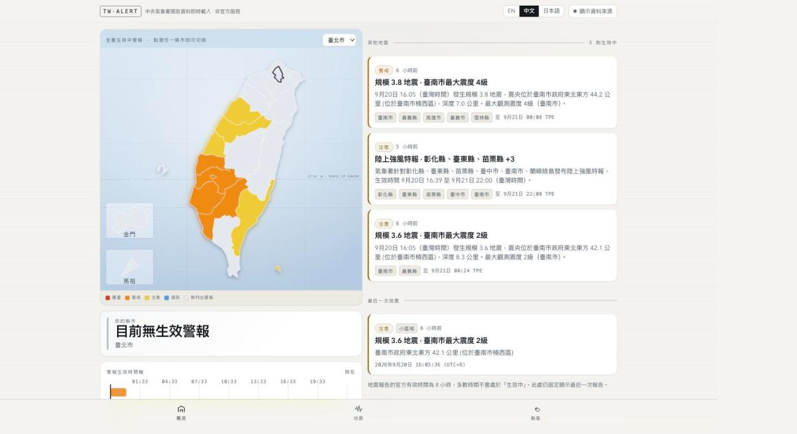

# Anshin

A disaster-alert page for foreigners living in Taiwan. It reads the Central Weather Administration's open data live in the browser and shows what is happening in English, 繁體中文 or 日本語.

The whole application is one HTML file. There is no build step, no bundler, no server and no API key to type in. Open `taiwan-alert.html` and it fetches the country's current conditions.

Live at [catsmice.github.io/anshin-app/taiwan-alert.html](https://catsmice.github.io/anshin-app/taiwan-alert.html), showing Taiwan's real conditions as of the moment you open it.



A real report replayed on the earthquake screen: M4.9 off Taitung on 14 September 2026. The P and S fronts expand from the epicenter at 6.0 and 3.5 km/s, and each of the 52 seismographs lights up when the S front reaches the epicentral distance CWA recorded for that station.

## Why

Taiwan's official warnings are published in Chinese. A migrant worker in Taichung, a tourist in Hualien or a foreign resident in Taipei finds out last, usually secondhand from somebody who can read the announcement for them. The data itself is public and open. The language is the barrier.

Anshin reads the same feeds the Chinese-language sites use and renders them in three languages, on a map that still works if you read none of them.

安心 (anshin) is Japanese for peace of mind.

## Running it

```sh
git clone https://github.com/catsmice/anshin-app.git
cd anshin-app
open taiwan-alert.html      # macOS, or just double-click the file
```

That hosted copy is this same file served straight from the repo by GitHub Pages. Nothing is built and nothing else is deployed.

It also runs from `file://`. CWA's API sends `Access-Control-Allow-Origin: *`, so a local page is allowed to fetch it directly. The key already in the file (`rdec-key-123-45678-011121314`) is CWA's public demo key and needs no signup.

You need a browser from 2023 or later. The stylesheet uses CSS `color-mix()`, which means Chrome 111, Safari 16.2 or Firefox 113 and up.

## Where the data comes from

Five datasets, fetched in parallel from `https://opendata.cwa.gov.tw/api/v1/rest/datastore/{id}`, each rendered the moment it lands instead of waiting for the slowest.

| Dataset | Contents |
| --- | --- |
| `W-C0033-001` | Weather warnings per county: which counties, which phenomenon |
| `W-C0033-002` | Weather warning narrative, the official prose, occasionally with an official English version |
| `E-A0015-001` | Significant earthquake reports |
| `E-A0016-001` | Small-area earthquake reports |
| `W-C0034-005` | Tropical cyclone tracks |

Each dataset has its own status row at the foot of the home screen: loaded and when, still loading, or failed with the error text and a retry button. A failed fetch never renders as "all clear". All five refetch every five minutes.

## How severity is decided

CWA publishes no severity level. Its `significance` field is the constant string `特報`, which flags a special report without saying how bad it is. Anshin computes four tiers itself: severe, warning, advisory, info.

Earthquakes rank on maximum observed intensity across counties. `5弱` and above is severe, exactly `4級` is warning, `0級` to `3級` is advisory. A tsunami warning in the report text (`海嘯警報` or `海嘯警訊`, as opposed to the routine "no tsunami" note) makes it severe whatever the shaking was.

Weather ranks on the phenomenon. The three grades of 豪雨 are severe, 大雨 is warning, and 強風, 濃霧, 低溫, 高溫 and 大雷雨 are advisories. A 特報 the app does not recognise becomes an advisory and never info, because an unknown warning must not render as calm.

Typhoons rank on distance. `W-C0034-005` lists every cyclone CWA tracks anywhere in the basin, including storms 1,700 km away aimed at Japan. A cyclone enters a county's alert stream only when its 15 m/s wind radius, or a forecast position inside the next 24 hours, comes within roughly 300 km of Taiwan. The rest stay on the typhoon screen as information.

Because the app computes these tiers itself, it says so wherever it prints one and shows the inputs the computation ran on.

## Show source

Every figure on screen is a claim about a real emergency, and the app's own disclaimer says the official announcement governs. So the header carries a Show source toggle that puts every card into a state where each displayed value carries:

- the dataset id it came from
- the JSON field path
- the raw untransformed value as it arrived, with `"970"` still a string
- CWA's issue timestamp for that record
- a link to the CWA page for the event

Values the app computed rather than read are labelled computed, with the rule stated in words and the inputs listed. A translated epicenter shows the Chinese it parsed and the four pieces it pulled out. A severity tier shows the intensity rows it compared. The affected-county list shows which Chinese area names resolved to which ISO codes, and which resolved to none.



The annotations are translated as well, so the audit reads in whichever language you picked.

## The field traps

Notes for anyone else building on these feeds. Each of these is handled in the code, and each one silently corrupts an app that misses it.

- The envelope's `success` is the string `"true"`, not a boolean.
- Field casing is inconsistent between datasets. Earthquake and typhoon records are PascalCase; the two weather-warning datasets are camelCase.
- Numbers arrive as strings in typhoon data (`"970"`, `"33"`) and as numbers in earthquake data (`4.9`, `10.1`).
- Two timestamp formats coexist. Earthquake and typhoon data use ISO-8601 with an offset. `W-C0033-*` uses space-separated local time with no offset at all, which is Asia/Taipei. Attach `+08:00` before parsing or every weather warning lands eight hours out.
- `E-A0016-001` reuses one `EarthquakeNo` for every quake in the response. It is not a unique key. Anshin keys earthquakes on `OriginTime`.
- `Intensity.ShakingArea` mixes two kinds of row: per-county rows carrying `InfoStatus: "observe"`, and summary rows without it whose `AreaDesc` reads like `最大震度4級地區`. The observe rows are authoritative; the summary rows are a fallback for reports that have none.
- `W-C0033-001` returns all 22 counties every time, most of them with an empty `hazards` array. Appearing in the response is not the same as having a warning.
- `W-C0033-002` delivers `contents.content` as an object on some records and an array on others.
- Some phenomena affect sub-county descriptors (`南投地區`, `山區`, `蘭嶼綠島`) that resolve to no county at all. That is correct, and they still have to show up somewhere instead of vanishing.
- Typhoon data keeps serving a cyclone's last known track long after it has passed. Anshin treats a latest fix older than 12 hours as inactive.
- CWA writes the orthodox `臺`, not `台`. The county lookup matches both spellings, and maps `恆春半島` up to Pingtung County.
- Intensity is a ten-tier scale written as strings with two different suffixes: `0級 1級 2級 3級 4級 5弱 5強 6弱 6強 7級`. Sorted as text, `5弱` lands in the wrong place. Anshin treats them as an ordinal 0 to 9.

## The maps

Three maps, one projection, one set of county outlines, so a county keeps the same shape everywhere:

- the nationwide map on the home screen, every county filled by the highest severity active in it, your own county outlined in ink, Kinmen and Lienchiang in their own labelled insets
- the shaking choropleth on the earthquake screen, coloured across the ten intensity tiers, with the epicenter at its real coordinates and every seismograph in the report placed at its own station coordinates, sized by peak ground acceleration
- the storm track on the typhoon screen, observed fixes solid, forecast fixes dashed, and the 15 and 25 m/s wind radii drawn to true scale in kilometres

The projection is equirectangular with longitude scaled by cos(latitude), written once in `makeProjection()` and reused by all three. The GeoJSON is inline. The favicon is drawn from the same geometry and filled with your county's current severity, so the browser tab carries the state too.



The home map is the region picker. Tap any county to switch to it.

Counties with nothing active are a neutral slate. Green would promise a safety check the app has not performed, and it knows only what CWA published.

The typhoon map frames the storm and Taiwan together until doing so would shrink Taiwan past recognition. Beyond that it keeps Taiwan at a readable size and draws the storm's bearing as an arrow to the edge of the frame, labelled with the distance.

## Three languages

English is the default, since the users are foreigners.

CWA always supplies Chinese and occasionally supplies official English. Anshin uses the official English where it exists and labels it official. Most active warnings ship a `zh-TW` narrative only, so every alert also gets an English and Japanese body written from the structured fields (phenomenon, counties, validity window, computed severity) and labelled as generated. The safety guidance in the app is written by the app and marked as such. A machine rendering of safety-critical wording is never presented as the official text.



The same screen in 繁體中文. Switching language reprints everything, including the generated alert bodies and the source annotations.

Japanese place names are folded to shinjitai, so `花蓮縣` reads as `花蓮県` and `臺東縣政府` becomes `台東県庁`.

CWA gives the epicenter only in Chinese, in a fixed pattern: `臺東縣政府東南東方 43.0 公里 (位於臺灣東南部海域)`. The distance is measured from the county government office, so the English reads `43.0 km ESE of Taitung County Hall`. When the parenthetical only repeats the county already named, it is dropped, so `花蓮縣政府南方 3.2 公里 (位於花蓮縣近海)` becomes `3.2 km S of Hualien County Hall, offshore`. Intensity values are translated as well: `5弱` is `5-lower` in English and `震度5弱` in Japanese, with a line noting that this is Taiwan's ten-tier shaking scale and not magnitude.

## Extras for a live audience

- `P` switches to a full-bleed presentation mode that hides the header and nav and leaves one map and one severity word. `Esc` returns.
- A timeline under the home map plots every validity window CWA published, with a playhead you can drag to see which warnings are still in force later tonight. Dragging repaints the county fills and the hero only, with no re-render, so it stays smooth.
- On the earthquake screen, P and S fronts expand from the epicenter at twenty times real time (6.0 and 3.5 km/s), and each seismograph lights up when the S front reaches the epicentral distance CWA reported for that station. It loops until you pause it. The animation is illustrative and says so; these are not CWA arrival times.
- `prefers-reduced-motion` skips the animation and draws the finished network straight away.

## What it does not know

- Whether a land or sea typhoon warning is in force. `W-C0034-005` carries no such flag, so the app states that it cannot tell instead of implying either answer.
- Whether work and school are suspended. Each city and county government announces that separately and it is absent from this data.
- Anything CWA has not published. An empty map means no warning was published, which is different from being safe.
- Earthquake reports carry an eight-hour official validity window, so most of the time none are active. The most recent quake is shown regardless, because "was that an earthquake just now?" is the question people actually open the app with.

Anshin is an independent third-party service. The official CWA announcement governs.

## Code layout

One file, one script, nine numbered sections:

| Section | What it holds |
| --- | --- |
| 1 Constants | dataset ids, the 22 counties with their Chinese, English and Japanese names, the phenomenon table, the guidance text, the inline GeoJSON |
| 2 i18n | every string in three languages, including the provenance rules themselves |
| 3 Utils | timestamp parsing, number coercion, great-circle distance, the provenance renderer |
| 4 Translation | Chinese area name to county code, epicenter parsing, shinjitai folding |
| 5 Severity | the four-tier rules, each returning its rule and the inputs it used |
| 6 Fetch and normalise | five fetches, then one alert model |
| 7 Projection and maps | the projection, path building, all three maps |
| 8 Views | home, alert detail, earthquake, typhoon, presentation |
| 9 Shell and boot | nav, language switch, keyboard, localStorage, refresh timers |

Nothing in the interface reads a CWA record directly. Every hazard first becomes `{id, hazardType, severity, issuedAt, expiresAt, startsAt, affectedRegions, regions, payload, datasetIds, sourceUrl, raw}`, and `raw` keeps the original CWA object so Show source can print it.

State lives in a single `state` object, and every view is a function that returns an HTML string. Language, selected county and the Show source setting persist in localStorage.

When the script runs without a `document`, its last block puts the parsers, the severity functions and the projection on `module.exports`, so they can be pulled into a Node test harness.

## License

MIT. See [LICENSE](LICENSE).

## Data

Weather, earthquake and tropical cyclone data come from the Central Weather Administration open data platform at opendata.cwa.gov.tw, used under its open data terms. Anshin is not affiliated with CWA.

Built for a Claude Builder Day event.
